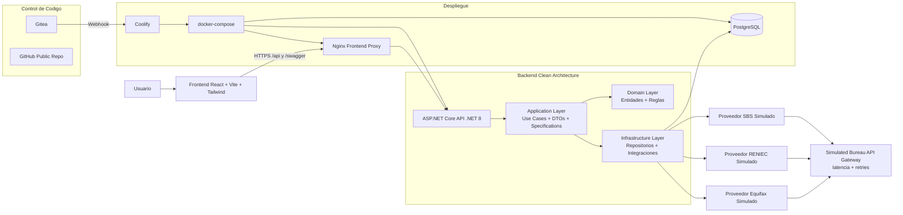

# Prueba Tecnica GlobalGo

Backend y frontend para el proceso de evaluacion crediticia de GlobalGo.

## Repositorio

- GitHub (publico): https://github.com/miguelgargurevich/globalgo

## Estructura del proyecto

- `backend/`
  - `GlobalGo.Api`: entrada HTTP (controllers, modelos API, Swagger)
  - `GlobalGo.Application`: casos de uso, contratos y DTOs
  - `GlobalGo.Domain`: entidades y reglas de dominio
  - `GlobalGo.Infrastructure`: persistencia PostgreSQL + proveedores de fuentes externas
  - `GlobalGo.Tests`: tests unitarios
  - `GlobalGo.sln`
- `frontend/`
  - React + Vite + Tailwind + Lucide React
- `docker-compose.yml`
  - PostgreSQL para entorno local
- `DECISIONES.md`
  - resumen de decisiones tecnicas
- `PRUEBAS_UI.md`
  - ejecucion de pruebas funcionales desde la interfaz y hallazgos
- `PRUEBAS_CRITERIO_CREDITO.md`
  - criterio del motor de decision y casos de prueba validados (Approved/Observed/Rejected)

## Stack tecnico

- .NET 8 (ASP.NET Core Web API)
- Clean Architecture (Api, Application, Domain, Infrastructure)
- Entity Framework Core + Npgsql (PostgreSQL)
- xUnit
- React + Vite + Tailwind + Lucide React
- Docker Compose

## Diagrama de arquitectura



## Ejecucion rapida (un solo comando)

Desde la raiz:

```bash
npm install
npm run dev
```

Este comando:

- levanta PostgreSQL en Docker
- levanta backend .NET
- levanta frontend Vite

URLs:

- Frontend: `http://localhost:5173`
- Backend API: `http://localhost:5015`
- Swagger: `http://localhost:5015/swagger`

Para apagar servicios de Docker:

```bash
npm run down
```

## Ejecucion por separado

### 1) Base de datos

```bash
docker compose up -d
```

PostgreSQL queda en `localhost:5433` con:

- database: `globalgo_credit`
- user: `globalgo`
- password: `globalgo`

### 2) Backend

```bash
cd backend
dotnet restore
dotnet test
dotnet run --project GlobalGo.Api
```

### 3) Frontend

```bash
cd frontend
npm install
npm run dev
```

## Endpoints principales

- `POST /api/credit-evaluations`
- `GET /api/customers/{dni}/history`
- `GET /api/portfolio-risk/report`

## Swagger (OpenAPI)

- Local: `http://localhost:5015/swagger`
- Producción: `https://globalgo.gargurevich.dev/swagger`

Con Swagger puedes:

- revisar todos los endpoints y modelos de request/response,
- ejecutar pruebas directas desde el navegador,
- validar rápidamente cambios en contratos HTTP.

### Ejemplos rapidos (copiar/pegar)

> En local usa `http://localhost:5015` y en producción `https://globalgo.gargurevich.dev`.

Evaluar solicitud de credito:

```bash
curl -sS -H 'Content-Type: application/json' \
  -d '{"Dni":"10000012","FullName":"Demo Approved","AmountRequested":2400,"MonthlyIncome":4000}' \
  http://localhost:5015/api/credit-evaluations
```

Historial por DNI:

```bash
curl -sS \
  'http://localhost:5015/api/customers/10000012/history'
```

Reporte de riesgo de cartera:

```bash
curl -sS \
  'http://localhost:5015/api/portfolio-risk/report'
```

## Documentacion de pruebas

- Casos de prueba y criterio de evaluacion: `PRUEBAS_CRITERIO_CREDITO.md`
- Pruebas funcionales UI: `PRUEBAS_UI.md`

### Quick QA Matrix

| Estado esperado | AmountRequested | MonthlyIncome | DNIs de prueba |
| --- | ---: | ---: | --- |
| Approved | 2400 | 4000 | 10000012, 10000013, 10000018, 10000019, 10000102, 10000103, 10000108, 10000109, 10000120, 10000121 |
| Observed | 3500 | 4000 | 10000000, 10000001, 10000002, 10000003, 10000004, 10000005, 10000006, 10000007, 10000009, 10000010 |
| Rejected | 2400 | 4000 | 10000008, 10000020, 10000021, 10000022, 10000023, 10000024, 10000025, 10000026, 10000044, 10000050 |

Notas:
- Rechazo por RENIEC: `10000008`, `10000026`, `10000044`.
- Rechazo por riesgo alto: resto de DNIs en `Rejected`.

## Notas de integracion

- La API tiene CORS habilitado para `http://localhost:5173`.
- Los enums de backend se serializan como texto (`Approved`, `Observed`, `Rejected`).
- El esquema de BD se inicializa al arrancar la API usando `EnsureCreated`.
- Patrón aplicado: Strategy + Provider Pipeline con `ICreditSourceProvider` para incorporar nuevas fuentes sin cambiar la orquestación principal.
- Las fuentes externas estan simuladas y se consultan en paralelo.
- La simulacion de burós incluye latencia variable, fallos transitorios controlados y reintentos automáticos.
- Parametros configurables en `appsettings`: `BureauApiSimulation:MinLatencyMs`, `MaxLatencyMs`, `MaxRetries`, `RetryBaseDelayMs`.

## Despliegue en VPS con Coolify + Gitea

### Estado actual del repositorio para deploy

- Backend containerizable: `backend/GlobalGo.Api/Dockerfile`
- Frontend containerizable: `frontend/Dockerfile`
- Proxy frontend -> API: `frontend/nginx.conf`
- Stack para Coolify: `docker-compose.coolify.yml`
- Variables ejemplo: `.env.coolify.example`

### Checklist en tu VPS

1. Coolify instalado y operativo en tu VPS.
2. Gitea accesible desde Coolify (misma red o acceso por HTTPS).
3. Repositorio subido a Gitea con estos archivos nuevos.
4. Dominio/subdominio configurado en Coolify para servicio `frontend`.
5. Variables de entorno definidas en Coolify (usar base de `.env.coolify.example`).

### Pasos en Coolify

1. Crear un recurso de tipo Docker Compose.
2. Seleccionar el repo en Gitea y rama `main`.
3. Indicar `docker-compose.coolify.yml` como compose file.
4. Configurar variables `POSTGRES_DB`, `POSTGRES_USER`, `POSTGRES_PASSWORD`.
5. Desplegar y validar:
  - Frontend cargando.
  - API respondiendo por `/api/credit-evaluations`.

### CORS en producción

- Si frontend y API van en dominios distintos, configura `CORS_ALLOWED_ORIGIN`.
- Si frontend usa el proxy nginx del mismo dominio (`/api`), CORS puede dejarse vacío.

### Seguridad

- Si el archivo `.env` contiene tokens reales, rotar credenciales antes del despliegue.
